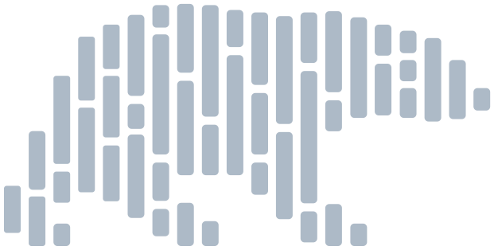
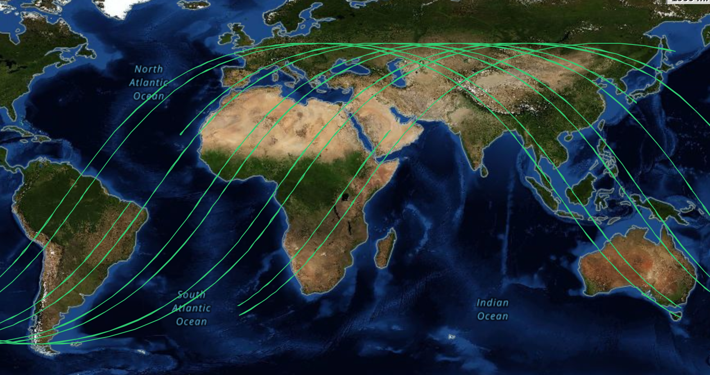
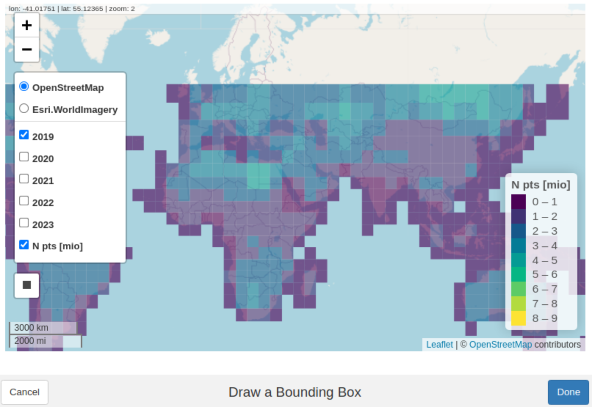
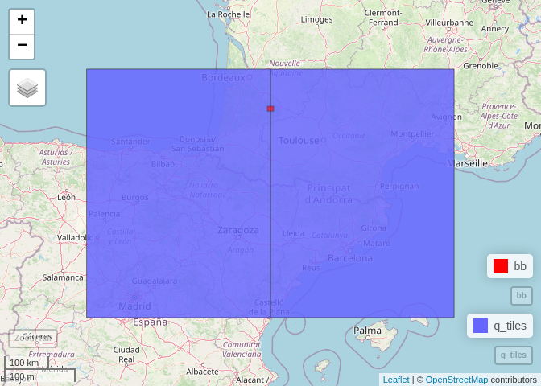
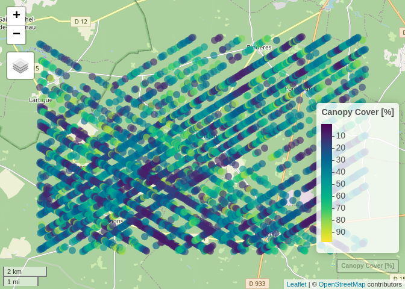

# GEDI Data Access on S3 using R
Johannes Heisig
2024-06-24

# Background




This notebook has the purpose of demonstrating how to conveniently
retrieve [GEDI](https://gedi.umd.edu/) Level 2A & 2B data from cloud
storage. GEDI is a full-waveform
[LiDAR](https://en.wikipedia.org/wiki/Lidar) sensor with the mission of
mapping biomass for global carbon dynamics research. The challenge with
this data is its large volume. GEDI carries out several million
measurements every day. These are processed to a table with close to 100
columns, describing, e.g., elevation and canopy structure, which easily
becomes larger than your computer’s memory. To handle such data we use
(the R bindings of) cloud-compatible software tools [Apache
Arrow](https://arrow.apache.org/) and [Polars](https://docs.pola.rs/).

GEDI data is originally administered and distributed by NASA, yet not an
easily accessible way. As GEDI in mounted on the ISS, it collects and
stores data along its orbital flight path. However, data along a narrow
line crossing all longitudes (on land and sea) is rarely useful in a
spatial analysis.



Therefore, we pre-processed and re-chunked all available data from the
start of the mission in April 2019 until the end of 2023 (with frequent
updates planned). The dataset is stored on a Wasabi Simple Storage
Service (S3) bucket, administered by
[OpenGeoHub](https://opengeohub.org/) and has ~5.4 billion observations
(~1TB). It is organized as a partitioned
[Parquet](https://parquet.apache.org/) dataset, which consists of one
file per 5x5 degree tile and year. Parquet is a column-oriented file
format with efficient storage and high compression properties.

# Setup

``` r
library(arrow)       # to handle parquet format
library(polars)      # fast access to parquet on S3
library(mapview)     # interactive maps
library(sf)          # spatial data handling

source("R/R_functions.R") # load functions for data access
```

# Spatial selection

The best way to select GEDI data of interest is defining a place and a
time window. We can create a bounding box for spatial selection in
multiple ways. A convenient one is running the code below, which opens
an interactive map for drawing a bounding box by hand. To guide your
selection the interactive map shows all available 5x5 degree GEDI tiles
and their point counts (in millions) for each year The returned geometry
is stored in `bb`.

``` r
bb = draw_bbox()
```



Let’s get an idea about the size of our bounding box:

``` r
st_area(bb) |> units::set_units("km^2")
```

    144.4922 [km^2]

# Create a query

## Bounding box

If we are only interested in the data enclosed by the bounding box we
can pass it to our query and possibly add more selection and filter
options. Here you can specify a temporal selection (`years`) or a
selection of data `columns` (with options `all`, `reduced`, or a
character vector with desired column names). If you want to see all
available options, call `show_gedi_columns()`.

Under the hood, `bbox_query()` uses the `{polars}` library to create (a
list of) optimized queries to the data on S3, which can be executed in
parallel.

``` r
q_bb = bbox_query(bb, years = 2020:2021, columns = "all")
```

A `{polars}` query may look like this:

``` r
q_bb[[1]]$describe_optimized_plan()
```


      Parquet SCAN https://s3.eu-central-1.wasabisys.com/gedi-ard/level2/l2v002.gedi_20190418_20230316_go_epsg.4326_v20240614/lon=0/lat=40/year=2021/gedi_l2_0.parquet
      PROJECT */94 COLUMNS
      SELECTION: [(col("longitude").is_between([-0.096983, 0.088887])) & (col("latitude").is_between([44.189111, 44.27686]))]

## Tiles

In case we want to study a larger area we can consider downloading
entire 5x5 degree tiles, which may be more efficient. Use `tile_query()`
with the bounding box from earlier and a selection of `years` to find
all intersecting tiles.

``` r
(q_tiles = tile_query(bb, years = 2020:2021))
```

    Simple feature collection with 4 features and 5 fields
    Geometry type: POLYGON
    Dimension:     XY
    Bounding box:  xmin: -5 ymin: 40 xmax: 5 ymax: 45
    Geodetic CRS:  WGS 84
      lon lat year                                        dir n_points
    1   0  40 2021  /lon=0/lat=40/year=2021/gedi_l2_0.parquet  2267680
    2   0  40 2020  /lon=0/lat=40/year=2020/gedi_l2_0.parquet  3113049
    3  -5  40 2020 /lon=-5/lat=40/year=2020/gedi_l2_0.parquet  3058438
    4  -5  40 2021 /lon=-5/lat=40/year=2021/gedi_l2_0.parquet  2785341
                            geometry
    1 POLYGON ((0 40, 5 40, 5 45,...
    2 POLYGON ((0 40, 5 40, 5 45,...
    3 POLYGON ((-5 40, 0 40, 0 45...
    4 POLYGON ((-5 40, 0 40, 0 45...

`tile_query()` returns an `sf`-object our spatio-temporal selection. It
has 4 entries, covering 2 tiles for 2 years.

We can visualize bounding box and tiles before download.

``` r
mapview(q_tiles) + mapview(bb, col.regions="red")
```



# Download

The `download_gedi()` function behaves differently depending on whether
its input originates from `bbox_query()` or `tile_query()`.

## Bounding box

Bounding box queries are executed through `{polars}`. A caveat of the
current implementation is that it cannot scan all tiles of interest at,
but rather sequentially sends one query per tile and year. Depending on
the complexity of the query, this may generate some considerable
overhead. For example, selecting a reduced number of `columns` in
`bbox_query()` will lead to smaller download file, yet to an overall
longer download time.

``` r
dir_bbox = "R/download_bbox"
## download_gedi(q_bb, out.dir = dir_bbox)
```

We can now read the downloaded data from disk using
`arrow::open_dataset()` and `dplyr::collect()`.

``` r
(data_bbox = open_dataset(dir_bbox) |> dplyr::collect())
```

    # A tibble: 4,516 × 94
       delta_time beamname shotnumber latitude longitude elev_lowestmode  rh100
            <int>    <int>    <int64>    <dbl>     <dbl>           <int>  <int>
     1   79913728        0       8e16     44.2  -0.0895            16370  -6645
     2   79913728        0       8e16     44.2  -0.0883            16179 -14509
     3   79913729        0       8e16     44.2  -0.0835            16754  -4537
     4   79913729        0       8e16     44.3  -0.0345            17070 -26837
     5   79913729        0       8e16     44.3  -0.0296            17973 -29036
     6   79913729        0       8e16     44.3  -0.0242            18463  -5144
     7   79913729        0       8e16     44.3  -0.0230            18536 -11445
     8   79913729        0       8e16     44.3  -0.0181            18662 -17108
     9   79913730        0       8e16     44.3  -0.00778           16932  29791
    10   79913730        0       8e16     44.3  -0.00656           16592 -31308
    # ℹ 4,506 more rows
    # ℹ 87 more variables: rh99 <int>, rh98 <int>, rh97 <int>, rh95 <int>,
    #   rh75 <int>, rh50 <int>, rh25 <int>, sensitivity <int>, night_flag <lgl>,
    #   rh100_a1 <int>, rh100_a2 <int>, rh100_a3 <int>, rh100_a4 <int>,
    #   rh100_a5 <int>, rh100_a6 <int>, rh99_a1 <int>, rh99_a2 <int>,
    #   rh99_a3 <int>, rh99_a4 <int>, rh99_a5 <int>, rh99_a6 <int>, rh98_a1 <int>,
    #   rh98_a2 <int>, rh98_a3 <int>, rh98_a4 <int>, rh98_a5 <int>, …

## Tiles

Downloading entire tile is a little more straight forward, as we access
existing parquet files without needing to query a subset of them. That
means one only needs to construct URLs and run a file download, which
can be run in parallel by setting `cores > 1` (currently only available
on Linux systems). By the default

``` r
dir_tiles = "R/download_tiles"
## download_gedi(q_tiles, 
##               out.dir = dir_tiles, 
##               cores = 4,
##               progress = T, 
##               require_confirmation = F, 
##               timeout = 3000)
```

Instead of `arrow::open_dataset()`, we can also use
`polars::scan_parquet()` to open the retrieved files, which is more
efficient for large datasets.

``` r
pl$scan_parquet(paste0(dir_tiles, "/*"))$collect()
```

    shape: (11_224_508, 91)
    ┌───────────┬──────────┬───────────┬───────────┬───┬───────────┬───────────┬───────────┬───────────┐
    │ delta_tim ┆ beamname ┆ shotnumbe ┆ latitude  ┆ … ┆ fhd_norma ┆ surface_f ┆ leaf_off_ ┆ l2b_quali │
    │ e         ┆ ---      ┆ r         ┆ ---       ┆   ┆ l         ┆ lag       ┆ flag      ┆ ty_flag   │
    │ ---       ┆ u8       ┆ ---       ┆ f64       ┆   ┆ ---       ┆ ---       ┆ ---       ┆ ---       │
    │ i64       ┆          ┆ i64       ┆           ┆   ┆ i16       ┆ bool      ┆ bool      ┆ bool      │
    ╞═══════════╪══════════╪═══════════╪═══════════╪═══╪═══════════╪═══════════╪═══════════╪═══════════╡
    │ 63762316  ┆ 0        ┆ 608600002 ┆ 40.0003   ┆ … ┆ 200       ┆ true      ┆ true      ┆ true      │
    │           ┆          ┆ 00233696  ┆           ┆   ┆           ┆           ┆           ┆           │
    │ 63762316  ┆ 0        ┆ 608600002 ┆ 40.000933 ┆ … ┆ 242       ┆ true      ┆ true      ┆ true      │
    │           ┆          ┆ 00233696  ┆           ┆   ┆           ┆           ┆           ┆           │
    │ 63762316  ┆ 0        ┆ 608600002 ┆ 40.001252 ┆ … ┆ 260       ┆ true      ┆ true      ┆ true      │
    │           ┆          ┆ 00233696  ┆           ┆   ┆           ┆           ┆           ┆           │
    │ 63762316  ┆ 0        ┆ 608600002 ┆ 40.00157  ┆ … ┆ 181       ┆ true      ┆ true      ┆ true      │
    │           ┆          ┆ 00233696  ┆           ┆   ┆           ┆           ┆           ┆           │
    │ 63762316  ┆ 0        ┆ 608600002 ┆ 40.001885 ┆ … ┆ 312       ┆ true      ┆ true      ┆ true      │
    │           ┆          ┆ 00233696  ┆           ┆   ┆           ┆           ┆           ┆           │
    │ …         ┆ …        ┆ …         ┆ …         ┆ … ┆ …         ┆ …         ┆ …         ┆ …         │
    │ 126151340 ┆ 7        ┆ 172791100 ┆ 42.022271 ┆ … ┆ 150       ┆ true      ┆ false     ┆ false     │
    │           ┆          ┆ 200242560 ┆           ┆   ┆           ┆           ┆           ┆           │
    │ 126151341 ┆ 7        ┆ 172791100 ┆ 42.0356   ┆ … ┆ 63        ┆ true      ┆ false     ┆ false     │
    │           ┆          ┆ 200242624 ┆           ┆   ┆           ┆           ┆           ┆           │
    │ 126151341 ┆ 7        ┆ 172791100 ┆ 42.035896 ┆ … ┆ 138       ┆ true      ┆ false     ┆ false     │
    │           ┆          ┆ 200242624 ┆           ┆   ┆           ┆           ┆           ┆           │
    │ 126151341 ┆ 7        ┆ 172791100 ┆ 42.036192 ┆ … ┆ 98        ┆ true      ┆ false     ┆ false     │
    │           ┆          ┆ 200242624 ┆           ┆   ┆           ┆           ┆           ┆           │
    │ 126151341 ┆ 7        ┆ 172791100 ┆ 42.037969 ┆ … ┆ 147       ┆ true      ┆ false     ┆ false     │
    │           ┆          ┆ 200242624 ┆           ┆   ┆           ┆           ┆           ┆           │
    └───────────┴──────────┴───────────┴───────────┴───┴───────────┴───────────┴───────────┴───────────┘

# Explore data

We have now successfully retrieved some GEDI data, which is almost ready
to be used in an analysis. Since the whole dataset on S3 has a massive
volume, some storage optimization was performed prior to upload. For
example all floating point numbers were scaled and converted to integers
in order to save memory. To translate our (local) data back to
meaningful values we can use `rescale_gedi()`.

``` r
data_rs = rescale_gedi(data_bbox)

head(data_bbox$cover)   # before rescaling
```

    [1] 8425 8358 1528  321  160 2738

``` r
head(data_rs$cover)     # after rescaling 
```

    [1] 84.25 83.58 15.28  3.21  1.60 27.38

Our data is now ready to go, so let’s display it on a map:

``` r
data_rs |> 
  make_sf() |> 
  dplyr::select(beamname:night_flag, cover) |> 
  mapview(zcol = "cover", alpha = 0, layer.name = "Canopy Cover [%]")
```


